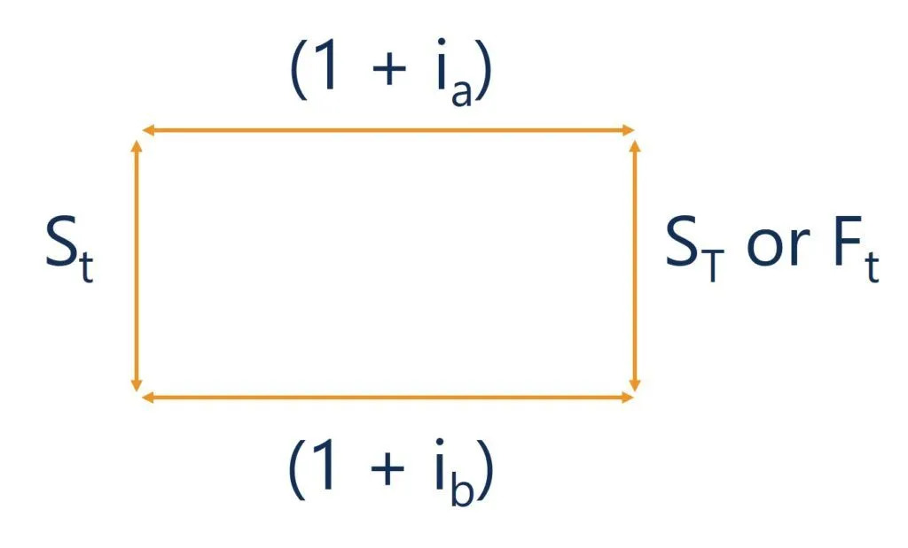

Điều gì ảnh hưởng đến tỷ giá?
> Vấn đề tỷ giá đang rất nóng gần đây, rất nhiều bài viết trên các trang mạng xã hội với nhiều kiến thức kì lạ và thuyết âm mưu với mục tiêu chủ yếu là để "bán hàng". Tỷ giá tăng đấy, mua bất động sản đi, mua chứng khoán ngành A,B,C đi, mua vàng đi ...
> Bài viết này, với kiến thức được lấy từ sách giáo khoa sẽ cho bạn một góc nhìn ít thiên lệch nhất về vấn đề tỷ giá. Nội dung chủ yếu là từ sách "Kinh tế học về tiền, ngân hàng và thị trường tài chính" sách đã được dịch và bán tại Việt Nam.

## 1. Yếu tố dài hạn ảnh hưởng đến tỷ giá
### a. Lý thuyết ngang bằng sức mua
Lý thuyết ngang bằng sức mua cho rằng, về dài hạn, hàng hóa nên có giá cả bằng nhau ở mọi nơi. Nên tỷ giá tiền tệ giữa hai quốc gia chính là tỷ số giữa một rổ hàng hóa của quốc gia này trên quốc gia kia. 
Ví dụ: Cùng một rổ hàng hóa như nhau, giá mua ở Mỹ là $100, và ở Nhật Bản, rổ hàng hóa đó có giá 10,000 Yen. Dựa trên lý thuyết này, tỷ giá USD/JPY =  10,000/100 = 100. Nghĩa là 1 USD mua được 100 Yen.
Như vậy, nếu một mặt hàng nào đó có giá $100 ở Nhật và vận chuyển đến Mỹ, giả sử chi phí vận chuyển bằng 0, sẽ có giá trị bằng $100. Và ngược lại, hàng hóa trị giá $100 tại Mỹ, chưa tính chi phí vận chuyển cũng sẽ có giá trị $100 ở Nhật hay ở bất kì đâu. 
Bây giờ, giả sử mức giá tại Nhật Bản tăng lên 10%, trong khi mức giá tại Mỹ không thay đổi. Rổ hàng hóa tại Nhật bây giờ là 11,000 Yên và $100 tại Mỹ, tỷ giá bây giờ là 11,000/100 = 11
<figure>

<figcaption align=center ><b>Tỷ giá thực tế dựa trên tỷ số CPI (đường màu đỏ) và tỷ giá giao dịch trên thị trường (đường màu xanh) cho thấy tỷ giá giao dịch trên thị trường và tỷ giá thực tế có xu hướng tương đồng</b>>
</figure>
Như vậy, theo mức giá ngang bằng sức mua, nếu một quốc gia có mức giá tương đối tăng, thì giá trị đồng nội tệ sẽ có mức giảm tương đương và ngược lại. Xin lưu ý, đây là góc nhìn về dài hạn
Lý thuyết ngang bằng sức mua không giải thích hết được tỷ giá giao dịch hằng ngày vì:

 - Một só hàng hóa, dịch vụ là không giao dịch xuyên biên giới được, như nhà, đất, dịch vụ cắt tóc hay hướng dẫn viên
 - Một số hàng hóa khó xác định là có giá trị như nhau ở các quốc gia khác nhau. Ví dụ, cùng là oto, giá của một chiếc Toyota có thể khác giá của Ford và, nếu giá của Toyota tăng không có nghĩa là giá yên sẽ giảm. Nghĩa là về trên thực tế, việc xác định một "rổ hàng hóa" tương đương nhau giữa các quốc gia là khó khăn.
 - Rảo cản giữa các quốc gia: Hạn mức nhập khẩu, thuế quan làm giá cả hàng hóa giữa các quốc gia có sự chênh lệch nhất định

Một ứng dụng của lý thuyết ngang bằng sức mua thường được sử dụng là "Chỉ số BigMac" theo đó, các nhà kinh tế xác định giá của chiếc bánh Burger này giữa các quốc gia khác nhau cho thấy giá trị của một số đồng tiền bị định giá mạnh yếu ra sao.

Xem thêm: 
[Lý Thuyết Ngang Bằng Sức Mua PPP - Wikipedia](https://en.wikipedia.org/wiki/Purchasing_power_parity)

### b. Các yếu tố ảnh hưởng tỷ giá trong dài hạn
Như lý thuyết ngang bằng sức mua PPP đã chỉ ra một số yếu tố gồm:
- Mức độ thay đổi của giá, được mô tả bằng CPI. 
- Rào cản thuế quan như hạn mức xuất, nhập khẩu và thuế xuất nhập khẩu
- Mức độ yêu thích hàng ngoại nhập so với hàng nội địa. Nếu người tiêu dùng ưa thích dùng hàng ngoại nhập, giá trị của đồng nội tệ sẽ thấp đi.
- Năng suất lao động. Cùng một đơn vị lao động trong một đơn vị thời gian tạo ra nhiều giá trị sản phẩm hơn sẽ giúp giảm giá bán nội địa và tăng giá trị xuất khẩu, từ đó giá trị đồng nội tệ sẽ tăng. 

## 2. Các yếu tố ngắn hạn ảnh hưởng đến tỷ giá

Các yếu tố tác động dài hạn giải thích được việc tăng giảm tỷ giá tính theo đơn vị năm (hoặc hơn). Tuy nhiên tỷ giá giao dịch hàng ngày trên thị trường tuân theo quy luật cung cầu. Do đó tỷ giá bị tác động bởi các yếu tố ngắn hạn khác gồm

### a. Tăng lãi suất đồng nội tệ
Việc tăng lãi suất đồng nội tệ khiến nhu cầu mua nội tệ để hưởng lãi suất cao tăng, làm giá đồng nội tệ giảm (so với ngoại tệ)

### b. Tăng lãi suất đồng ngoại tệ
Ngược lại với mục a, tăng lãi suất ngoại tệ khiến nhu cầu mua ngoại tệ (để hưởng lãi suất cao) tăng khiến giá nội tệ giảm

### c. Các yếu tốt tâm lý 

- Kì vọng lạm phát tăng
- Kì vọng nhập siêu tăng
- Kì vọng rào cản thuế quan tăng
- Kì vọng năng suất lao động tăng

## 3. Công thức ngang bằng lãi suất

Ngang bằng lãi suất giả sử rằng dòng vốn giữa hai quốc gia A, B được di chuyển tự do và không tốn chi phí chuyển đổi. 

Gọi A, B là rổ tài sản của hai quốc gia khác nhau 

S_t là tỷ giá tại thời điểm t của A/B

S_{t+1} là tỷ giá tại thời điểm t+1 của tài sản A, B

ia, ib là lãi suất tại quốc gia A,B

Tại thời điểm t
$ S_t = {A\over B}  $  (1)

Tại thời điểm t + 1.
Giá trị tài sản A là $ A(1 + ia)$ ,của B là $B(1 + ib)$

Tỷ giá tại t+1

$S_{t+1} = {A(1+ia) \over B(1+ib)} $ (2)

Chia công thức (1) cho (2) và biến đổi ta có

$S_{t+1} = S_t({(1+ia) \over (1+ib)}) $

Nghĩa là: Tỷ giá (giữa A/B) tại thời điểm t+1 tăng khi lãi suất của a tăng và giảm khi lãi suất của B giảm

> Công thức này cho thấy xu hướng đơn giản & ngắn hạn của tỷ giá dựa trên lãi suất tăng giảm giữa các quốc gia

## Tổng kết
Các chỉ số vĩ mô như tỷ giá được mọi người quan tâm và tranh luận rất nhiều. Tuy nhiên, việc sử dụng một công thức "trên trời" hay "nhẩm tính" của cộng đồng mạng thực sự gây ngạc nhiên cho người viết. Đặc biệt việc sử dụng các công thức đó cho việc dự đoán ngắn hạn và dài hạn của thị trường, tài sản, và ngành có thể gây hiểu nhầm cho các nhà đầu tư F0. Kiến thức hàn lâm có thể không giải thích hết được mức độ dao động của thị trường, tuy nhiên nên bám vào sách giáo khoa để không hoảng loạn và tin nhầm vào các loại "thuốc lang băm", tránh tiền mất tật mang.

